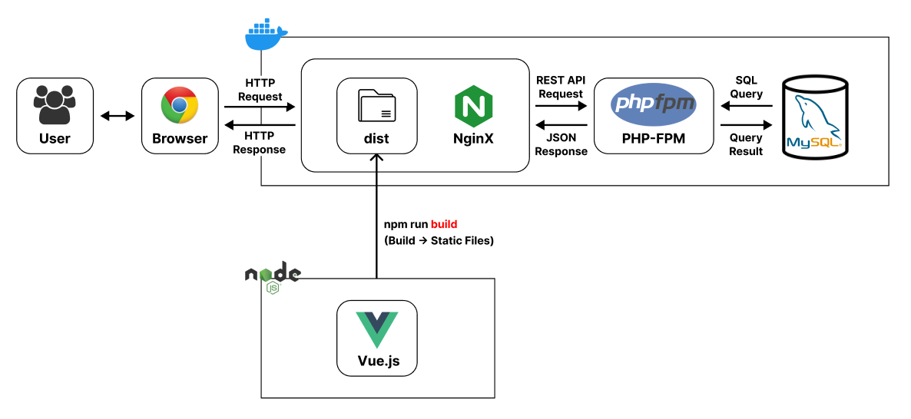
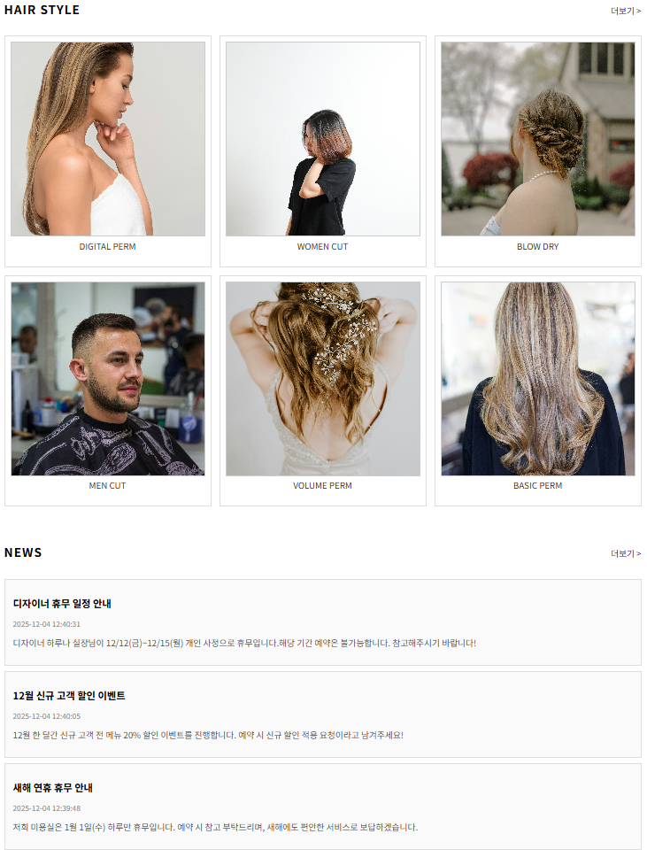
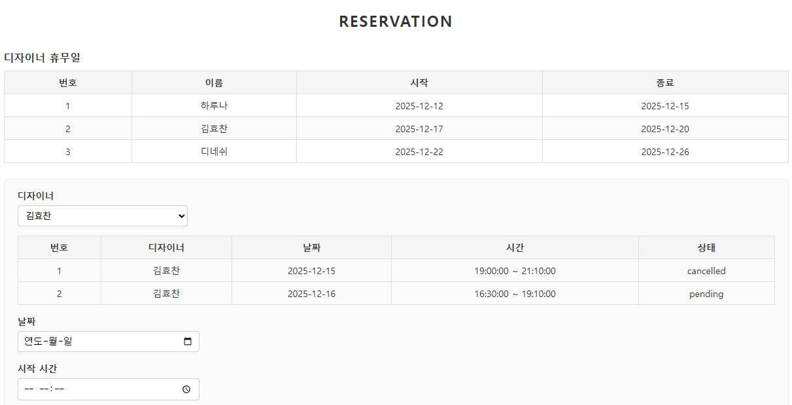
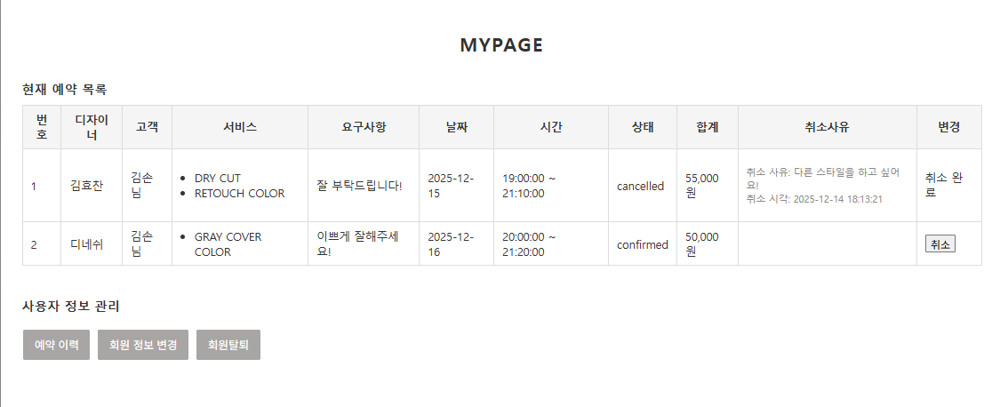
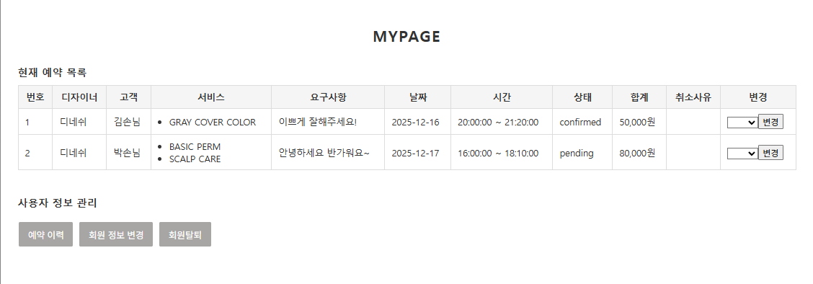
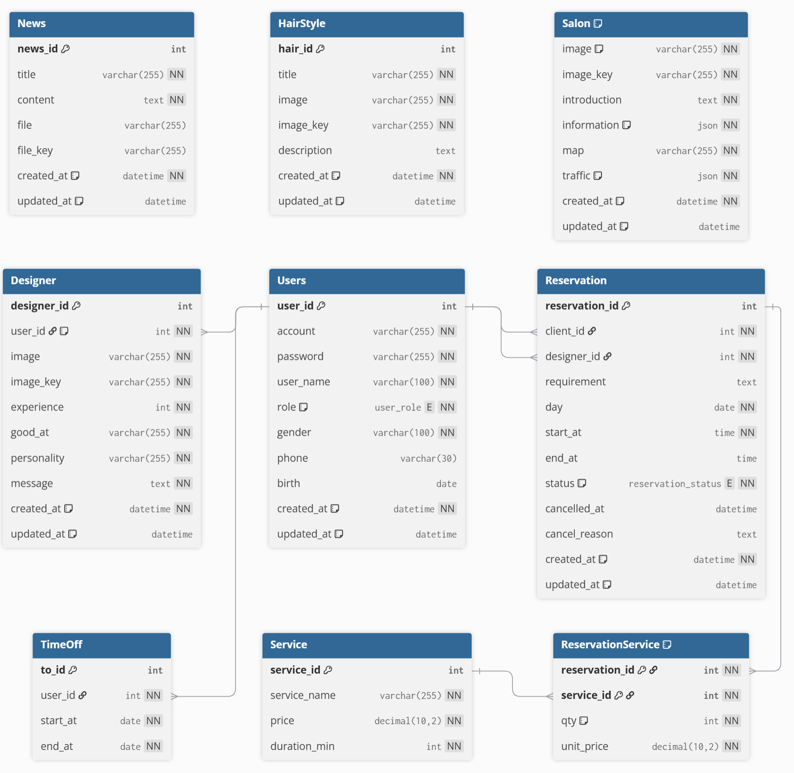

[](https://vuejs.org/)
[](https://vitejs.dev/)
[](https://pinia.vuejs.org/)
[](https://router.vuejs.org/)
[](https://axios-http.com/)

🌐 [한국어](README_ko.md) | **日本語**

---

# CS25-3 美容室予約システム (Frontend)


Vue 3ベースの美容室予約システムフロントエンドプロジェクトです。

## システムアーキテクチャ



## 主要機能

### メインページ


### 予約システム



### マイページ

役割別のマイページを提供します。

| 顧客 | デザイナー | マネージャー |
|------|------------|--------------|
|  |  |  |

#### ゲストマイページ


## プロジェクト構造

```
v01/
├── src/
│   ├── api/           # API通信モジュール
│   │   ├── client.js
│   │   ├── designer.js
│   │   ├── hairstyle.js
│   │   ├── news.js
│   │   ├── reservation.js
│   │   ├── salon.js
│   │   ├── service.js
│   │   ├── timeoff.js
│   │   └── users.js
│   ├── assets/        # 静的リソース
│   ├── components/    # 共通コンポーネント
│   │   ├── FormField.vue
│   │   ├── SubmitButton.vue
│   │   └── layout/
│   │       ├── Header.vue
│   │       ├── Footer.vue
│   │       └── MainHero.vue
│   ├── router/        # ルーター設定
│   ├── stores/        # Piniaストア
│   ├── views/         # ページコンポーネント
│   │   ├── designer/
│   │   ├── hairstyle/
│   │   ├── main/
│   │   ├── mypage/
│   │   ├── news/
│   │   ├── reservation/
│   │   ├── salon/
│   │   ├── service/
│   │   └── users/
│   ├── App.vue
│   └── main.js
├── package.json
└── vite.config.js
```

## ERD



## はじめに

### インストール

```bash
cd v01
npm install
```

### 開発サーバー起動

```bash
npm run dev
```

### プロダクションビルド

```bash
npm run build
```

### プレビュー

```bash
npm run preview
```

## 機能一覧

- **ユーザー管理**: 会員登録、ログイン、情報修正
- **予約管理**: 予約作成、過去の予約照会
- **デザイナー管理**: デザイナー登録、一覧照会、情報修正
- **ヘアスタイル管理**: ヘアスタイル登録、一覧照会、詳細照会、修正
- **ニュース/お知らせ**: ニュース登録、一覧照会、詳細照会、修正
- **サロン情報**: サロン詳細情報、情報修正
- **サービス管理**: サービス登録、一覧照会、修正
- **マイページ**: 役割別カスタムマイページ（顧客、デザイナー、マネージャー）
