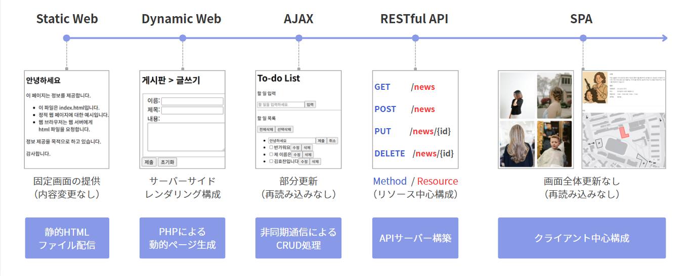

[](https://vuejs.org/)
[](https://vitejs.dev/)

🌐 [한국어](README_ko.md) | **日本語**

---

# CS25-3 美容室予約システム (Frontend)


Vue 3ベースの美容室予約システムフロントエンドプロジェクトです。

顧客は希望する美容室、デザイナー、サービスを選択して予約でき、デザイナーとマネージャーは予約管理およびサロン運営に必要な機能を利用できます。

## システムアーキテクチャ


## 主要機能

### メインページ


サロン情報、デザイナー紹介、提供サービスなどを一目で確認できるメインページです。

### 予約システム


希望する日時、デザイナー、サービスを選択して簡単に予約できます。

### マイページ

役割別のマイページを提供します。

| 顧客 | デザイナー | マネージャー |
|------|------------|--------------|
|  |  |  |

- **顧客**: 予約履歴の確認、個人情報の修正
- **デザイナー**: スケジュール管理、予約確認、休暇申請
- **マネージャー**: サロン全体の管理、デザイナー管理、サービス管理

#### ゲストマイページ


## 問題状況と成長ポイント



### 問題状況
学科カリキュラムにデータベース科目がなく知識不足の状態 → プロジェクト構造上DB活用が必須

### 困難だった点
- DB経験がないまま開発を進める必要があった
- 学習時間とプロジェクト進行が同時に負担となった
- → チーム全体の理解度向上が必要だった

### 解決策
- システム全体の流れを分析し、必要な要素のみ学習
- 核心概念を整理して学習効率を向上
- → 資料共有と実演を通じてチーム理解度を向上

### 成長ポイント
> **基礎から段階的に学習し理解を深めた経験** + **知識共有によるチーム協働力向上** = **構造的学習と共有によって個人とチームの成長を同時に実現**

## プロジェクト構造

```
v01/
├── src/
│   ├── api/           # API通信モジュール
│   │   ├── client.js
│   │   ├── designer.js
│   │   ├── hairstyle.js
│   │   ├── news.js
│   │   ├── reservation.js
│   │   ├── salon.js
│   │   ├── service.js
│   │   ├── timeoff.js
│   │   └── users.js
│   ├── assets/        # 静的リソース
│   ├── components/    # 共通コンポーネント
│   │   ├── FormField.vue
│   │   ├── SubmitButton.vue
│   │   └── layout/
│   │       ├── Header.vue
│   │       ├── Footer.vue
│   │       └── MainHero.vue
│   ├── router/        # ルーター設定
│   ├── stores/        # Piniaストア
│   ├── views/         # ページコンポーネント
│   │   ├── designer/
│   │   ├── hairstyle/
│   │   ├── main/
│   │   ├── mypage/
│   │   ├── news/
│   │   ├── reservation/
│   │   ├── salon/
│   │   ├── service/
│   │   └── users/
│   ├── App.vue
│   └── main.js
├── package.json
└── vite.config.js
```

## ERD


## はじめに

### インストール

```bash
cd v01
npm install
```

### 開発サーバー起動

```bash
npm run dev
```

### プロダクションビルド

```bash
npm run build
```

### プレビュー

```bash
npm run preview
```

## 機能一覧

- **ユーザー管理**: 会員登録、ログイン、情報修正
- **予約管理**: 予約作成、過去の予約照会
- **デザイナー管理**: デザイナー登録、一覧照会、情報修正
- **ヘアスタイル管理**: ヘアスタイル登録、一覧照会、詳細照会、修正
- **ニュース/お知らせ**: ニュース登録、一覧照会、詳細照会、修正
- **サロン情報**: サロン詳細情報、情報修正
- **サービス管理**: サービス登録、一覧照会、修正
- **マイページ**: 役割別カスタムマイページ（顧客、デザイナー、マネージャー）
